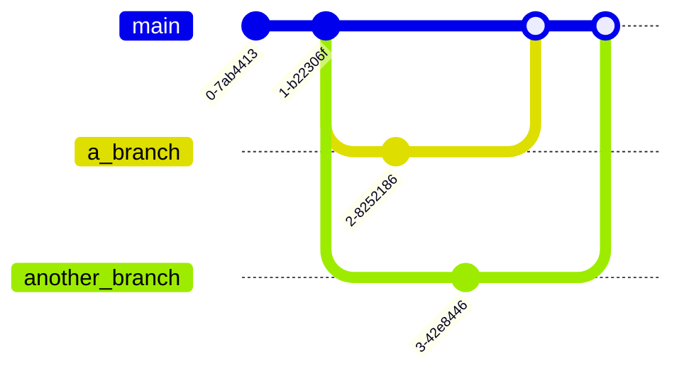

# Software Development for Business: Version Control and Docker 

# Git and Version Control

Git is a distributed version control system (DVCS) designed to handle 
everything from small to very large projects with speed and efficiency. It 
allows multiple developers to work on a project simultaneously without 
interfering with each other's changes. Some key featuers of Git are:
- Distributed Architecture: Every developer has a full local copy of 
the repository, including its history. Users can work offline. 
- Efficient Handling of Large Projects: Git is optimized for performance 
and can handle large repositories. 
- Branching and Merging: Flexible workflows. 
- Allows for complete project history and history tracking. 
- Manages small changes. Test, undo or fix easily. 

## Git's Graph Model

- Git uses Directed Acyclic Graphs (DAG) to define the relationship between 
the commits and the repository, where the arrows point to the a given 
commit's parents.
- Each commit is a node. 



## Git References

- References are helpful when navigating and managing commit histories. 
They make it easy to track, organize, and switch between different states 
of a repository. 
- A reference or `ref` in Git point to:
	1. A specific commit SHA-1 hash. All commit sgenerate a unique 
SHA-1 hash as an identifier, for tracking and integrity. 
	2. Another, symbolic reference ('master', 'main', 
'name_of_branch', etc.) 
- Types of references include branch references, tags, and HEAD.

### Branch Labels 
- A branch label is a reference that will point to the most recent commit 
in that branch. Recall that a branch is just a pointer to a specific 
commit. 


- All local branch references are stored in `.git/refs/heads`:
```bash
cd .git && ls
```
```bash
#output
COMMIT_EDITMSG	 ORIG_HEAD   description   index   logs   packed-refs
HEAD   config   hooks   info   objects   refs
```
```bash
cd refs && ls
```
```bash
#output
heads   tags
```
```bash 
cd heads && ls
```
```bash
#output
main   another_branch   all_other_branches
```
### The HEAD reference
- It is a reference to the commit we are currently in. There is only one 
HEAD per repository. 
- Therefore, it will usually point to the branch label of the current 
branch, unless we are working in a commit that is not the most recent one. 

```bash
cd .git && cat HEAD
```
```bash
#output
ref: refs/heads/main
```

### Tags

#### Lightweight Tags:
- A pointer to a specific commit, just like a branch, but without any 
additional metadata. It therefore simply marks the commit with a name. 
```bash
git tag <tagname> [<commit>]
#HEAD is the default value for <commit>
#Ex: git tag v1.0 will tag the commit we are currently in as v1.0. 
```

#### Annotated Tags
- Full objects stored in the Git database containing tagger's name, email, 
date of tagging, a tagging message, and other metadata.
- These are used for marking important releases or points in a given 
project's history. 
```bash
git tag -a [-m <msg>|-F <file>] <tagname> [<commit>]
#-F <file> indicates the file containing the text message
#Ex: git tag -a v1.0 -m "Version1.0release"
```
#### On Pushing Tags
`git push` does not transfer tags to the remote repository by default. We 
need to transfer these manually.
```bash
#to tranfer a specific, single tag
git push <remote> <tagname>
#Ex: git push origin v1.0
```   
```bash
#to transfer all local tags
git push <remote> --tags
#Ex: git push origin --tags
```

 ## Commits
A git repository is a series of snapshots, or commits. Each commit 
contains all the directories and files of the project at the time of 
the snapshot. 
- All commits belong to a **branch**.

## On Git syntax
```bash
git [command][--flags][arguments]
```
- `-f` of `--flag` Dash or double dash change the command's 
behaviour. 
- `|` Vertical bar represents `OR`.
- `[optional]` Optional values are surrounded by brackets. 
- `<placeholders>` are surrounded by angle brackets, and they 
indicate where a specific value should be placed. 
```bash
git commit -m <message>
```
- `[<optional placeholders>]
- `--` standalone bashed indicate that whay follows is a path.
```bash
git checkout experiment
#could be a file or path
```
```bash
git checkout --experiment
# Is a file
``` 
# Branching Labels 

In Git, branches and tags are used to label specific commits for easier 
reference. 

## Branches 
- A branch is a movable pointer to a commit. Its purpose 
is to isolate work on a specific feature or bug fix. Default branches are 
usually named main or master. 
- Brances are independent lines of development of the project. 

## Tags
- Tags are references that point to specific points in Git history. Mark 
release points (e.g., v1.0, v2.0) for easy acccess. 
- *Types of tags*:
	
1. **Annotated Tags**: Stored as full objects in the Git database. 
2. **Lightweight Tags**: Simple pointers to a commut, not stored as 
objects. 

- Listing Branches:
```bash
git branch
```

- Listing Tags:
```bash
git tag
```

3. Git Tags and git show
Tags are used to mark specific points in history as being important. 
- **Annotated Tags**: Store metadata: tagger name, email, date, and a 
message. 
```bash
git tag -a v1.0 -m "Release version 1.0"
```

- **Lightweight Tags**: Just a pointer to a commit.
```bash
git tag v1.0
```

### Pushing Tags to Remote
Note that, by default, `git push` does not transfer tags to remote 
repositories. These need to be explicitly pushed:
```bash
git push origin v1.0
```

Or push all tags:
```bash
git push origin --tags
```

The commit details being pointed to can be displayed using git show, 
including the tag message if it is an annotated tag.

```bash
git show v1.0
```

# Branches
Branches are a way to work in different version of a repository at one 
time. They can be understood through 2 main components:
- *Branch Pointer*: A branch in Git is simply a pointer to a commit. 
- *HEAD*: A special pointer that refers to the current branch. 
- By default there is a single branch called master, or main. 

## Best Practices
Since a branch is ideally an independent line of development of a 
project it is best to create a new branch for each feature or bug 
fix. In this way, we can keep the main branch stable, and merge 
tested and stable code 
only into the main. 

Creating a branch: Create a new branch called '''feature-branch''' 
pointing to the current commit. 
```bash
git branch feature-branch
```

Checking out a branch: Switch the working directory to the specified 
branch. 
```bash
git checkout feature-branch
```

Create and switch in one command:
```bash
git checkout -b new feature
```

Deleting a branch: Deletes `feature-branch` if it has been merged to 
the current branch. 
```bash
git branch -d feature-branch
```

Force delete: Deletes `feature-branch` regardless of its merge status.
```bash
git branch -D feature-branch
```

*Undoing a branch deletion with reflog*
git reflog shows a log of all the actions (commits, checkouts, resets) tht 
have moved to HEAD.
```bash
git reflog
```

Find the commit hash: Look for the commit where the branch pointed to 
before deletion.

Afterwards, we can create a new branch feature-branch pointing to the 
specificed commit:
```bash
git branch feature-branch <commit-hash>
```

# Merging 
Merging is the process of integrating changes from one branch into 
another. 

*Types of Merges*: 
- *Fast-Forward Merge*: Moves the branch pointer forward. 
- *Three-Way Merge (Merge Commits)*: Creates a new commit that has more 
than one parent. 

*Merge Conflicts*: These occur when the same part of the code has been 
modified differently in the branches being merged. 

*Merge Commits*: Commits that have more than one parent, typically two. 
They represent the convergence of two branches. 

Merges `feature-branch` into `main`. If `main` has progressed 
since the creation of the branch, Git performs a three-way merge, 
resulting in a new merge commit:
```bash
git checkout main
git merge feature-branch
```

*Fast-Forward Merges*: Occur when the branch you are merging has all of 
the commits ahead of your current branch and there are no divergent 
commits. 
*When is Fast-Forward possible?: Only possible when the current branch has 
not diverged from the branch being merged. That is, the project follows a 
linear history, where there are no commits with more than 1 parent (merge 
commits between the branches).

*Note*: Since a FF Merge does not create a new commit, it does not capture 
the history of the merge event.  

If `main` has not progressed and `feature-branch` is ahead, Git 
simply moves `main` to point to the same commit as 
`feature-branch`. 

```bash
git checkout main
git merge feature-branch
```

**Forcing No Fast-Forward**: For when we want to create a merge commit 
even when a fast-forward is possible. Useful to preserve the branch history.
```bash
git merge --no-ff feature-branch
```
 
# Resolving Merge Conflicts
Merge conflics happen when Git cannot automatically merge changes. Thes 
conflicts occur when:
- The same lines in the same files have been changed in both branches. 
- A file deleted in one branch and modified in another. 
The commits involved in a conflict are HEAD (the current commin on our branch) 
and MERGE_HEAD (the commit(s) from the branch we are merging). 

*Identifying Conflicted Parts*: When a conflic occurs, Git marks the 
conflict in the affected lines:

```
<<<<<<< HEAD
Your changes (from current branch)
=======
Incoming changes (from merged branch)
>>>>>>> feature-branch
```

*Fixing Files with Conflicts*:
1. Open the conflicted file: Using vim, nano, etc. 
2. Resolve the conflict: Decide what changes to keep, and manually edit 
the file to combine changes if necessary. Remove the conflict markers 
(<<<, ===, >>>). 
3. Mark the conflict as resolved:
```bash
git add <file>
```
4. Commit the merge:
```bash
git commit
```

# Fetching Pulling and Pushing
Commands used to synchronize our local repository with a remote one. 

## Fetching
Download commits, files, and refs from a remote repository into our local 
one, but do not merge them. 
```bash
git fetch origin
```

## Pulling
Fetches and then merges changes from the remote ```main``` branch into our 
current branch. 
```bash
git pull origin main
```
or, equivalently:
```bash
git fetch origin 
git merge origin/main
```

## Pushing
Upload your local commits on `feature-branch` to the remote 
repository. 
```bash
git push origin feature-branch
```

*Best Practices*:
- Pull before push: Always pull changes from the remote repository before 
pushing any changes to avoid merge conflicts. 
- Use branch names: Specify the branch when pulling or pushing to avoid 
confusion.

# Git Undo Operations
Commands to undo changes at various stages. 

*Unstaging Changes*: Remove <file> from the staging area but leave 
working directory unchanged.
```bash
git reset HEAD <file>
```
`HEAD` refers to the most recent commit on the current branch. Specifying 
`HEAD` tells Git to reset the file's staged version to match the version 
in the last commit. 

 *Discarding Local Changes*: Revert <file> in the 
working directory to match the HEAD commit. Replaces the changes in your 
working directory for the specified file(s) with the version from the last 
commit in the current branch.
 ```bash
git checkout <file>
```

*Reverting Commits*: Create a new commit that undoes the changes from 
<commit-hash>. Useful when we need to undo a commit that has already been 
shared with others, as it does not delete the commit but instead creates 
a new one reversing the changes introduced by the target commit. **Commit 
history is preserved.**

 ```bash
git revert <commit-hash>
```

*Resetting Commits*:
- Soft Reset: Move the branch pointer to <commit-hash>; staging area and 
working directory remain unchanged. Changes made in the commits after 
`<commit-hash>` are "unstaged" but remain in the staging area. 

```bash
git reset --soft <commit-hash>
```

- Mixed Reset: Move the branch pointer and reset the staging area to match 
<commit-hash>; working directory remains unchanged. Changes from commits 
after `<commit-hash>` will be retained in the working directory but will 
no longer be staged for commit. 

```bash
git reset <commit-hash>
```

- Hard Reset: Moves the branch pointer, resets the staging area and 
working directory to match <commit-hash>. *This discards uncommitted 
changes.*. It is a destructive command as it will permanently discard 
changes after `<commit-hash>`.
```bash
git reset --hard <commit-hash>
# use carefully, can lead to data loss
```

*Amending Commits*: Modify the most recent commit. Useful when fixing 
minor mistakes in the last commit that have not been yet pushed. 
```bash
git commit --amend -m "Updated commit message"
```

# Pull Requests
Pull requests allow users to 1) review changes before they are merged 
2) use a common plae to discuss proposed changes and 3) run automated 
tests and checks before merging. 

## Single Repository
In a shared repo model, all collaborators have push access. 

1. Create a branch
```bash
git checkout -b feature-branch
```

2. Make changes and commits
```bash
git add .
git commit -m "Implement feature X"
```

3. Push the branch to remote:
```bash
git push origin feature-branch
```

4. Open a pull request:
	- Navigate to the repository on the platform (GitHub)
	- Click on "New Pull Request"
	- Select `feature-branch` as the source and `main` as the 
target. 
	- Add a description and submit.

## Multiple Repositories and Forking
Here, external contributors can contribute without having push access to 
the main repository. 

1. Fork the Repository:
	- Click on "Fork" on GitHub to create a copy under your account. 
2. Clone the fork:
```bash
git clone <forked-repo-url>
```

3. Add upstream remote:
```git bash
git remote add upstream <original-repo-url>
```

4. Sync with upstream:
```bash
git fetch upstream
git checkout main
git merge upstream/main
```

5. Create a branch and make changes:
```bash
git checkout -b feature-branch
```

6. Push to the fork:
```bash
git push origin feature-branch
```

7. Open a pull request:
	- Go to the original repository on GitHub.
	- Click on "New pull request"
	- Select your fork and branch as the source.

# Git Graph Structures
Understanding Git's underlying data model is crucial for mastering its 
operations. 

## Understanding Commit Graphs
- *Directed Acyclic Graph (DAG)*: Git stores commits as nodes in a DAG, 
where each commit points to its parent(s). 
- *Commits*:
	- *Snapshot*: Each commit is a snapshot of the entire repository 
at a point in time. 
	- *Metadata*: Contains author, data, message and pointers to 
parent commits. 
- *Branches and Tags*:
	- *Branches*: Pointers to commits, they move forward as new 
commits are added. 
	- *Tags*: Static pointers to specific commits. 

## Visualizing Commit History
Use `git log` with graphical options to visualize the commit graph. 
*Compact Graph*:
```bash
git log --oneline --graph --all
```
*Example output*:
```sql
*   3e7a6f7 Merge branch 'feature-xyz'
|\
| * 1f4d8c2 Add feature XYZ
* | b5a1c3f Fix bug in authentication flow
| * e6c1d14 Add unit tests for feature XYZ
|/
* 234ae42 Refactor database schema
* a1c9e13 Initial commit
```
1.`--oneline`: This flag shows each commit on a single line for 
brevity, each line including:
- the **short hash** of the commit (e.g., `3e7a6f7`), a shortened 
version of the full commit hash. 
- the **commit message** (e.g., `Merge branch 'feature-xyz'), giving 
a quick description of what the commit is about. 

2. `--graph`: This option adds a visual representation of the commit 
history's branching and merging structure. Characters like `*`, `|`, 
`\`, `/` form a graph showing the relationships between commits:
- `*`: indicates a commit. 
- `|`, `\`, `/` represent paths or branches connecting commits, 
helping to visualize how different branches diverge and merge back 
togeher. 

3. `--all`: This option displays the commit history from all 
branches, not just the currently checked-out branch. 

Therefore, in the case above, `* a1c9e13 Initial commit` is the very 
first commit in the repository, marked as `initial commit`. `* 
234ae42 Refactor database schema` is a regular commit on the main 
branch. `| * 1f4d8c2 Add feature XYZ` is a commit on the 
`feature-xyz` branch (`*`), connected to the main branch by `|`. The 
commit message indicates that the `XYZ` feature was added. `| * 
e6c1d14 Add unit tests for feature XYZ` is another commit on the 
`feature-xyz` branch. 

*Detailed Graph:
```bash
git log --graph --decorate --pretty=oneline --abbrev-commit
```

*Example output*:
```sql
* commit e5f6d7a (HEAD -> main, origin/main)
| Merge branch 'feature-branch'
|
| * commit a1b2c3d (feature-branch)
| | Add feature X
| |
|/
* commit 9f8e7d6 Initial commit
```
- Branches: Lines diverging and converging represent branches. 
- Merge commits: Points where branches converge. 
