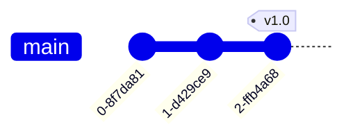
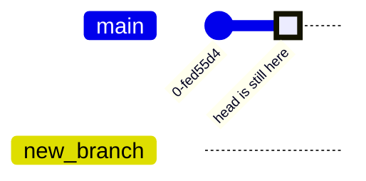
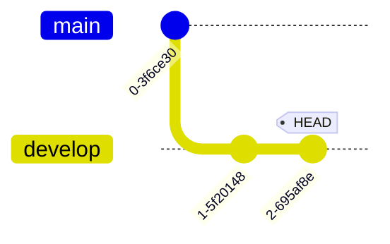
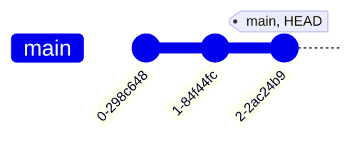
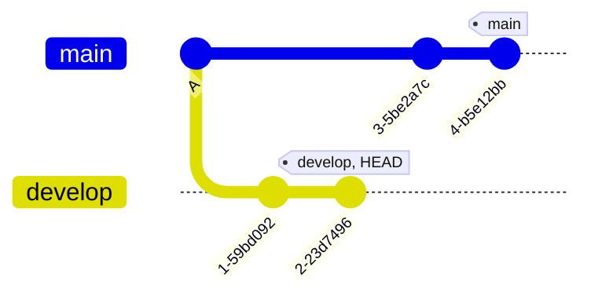
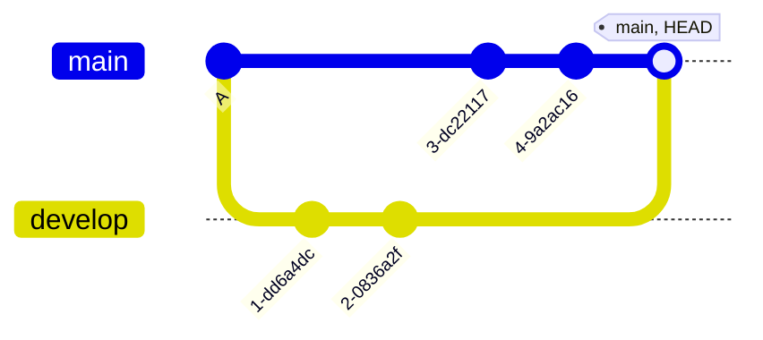

# Software Development for Business: Version Control Using Git 

## Table of Contents

  - [Reading Git Information and Credentials](#reading-git-information-and-credentials)
    - [Username and Email](#username-and-email)
- [Git and Version Control](#git-and-version-control)
  - [Git's Graph Model](#gits-graph-model)
  - [Git References](#git-references)
    - [Branch Labels](#branch-labels)
      - [Branches](#branches)
    - [The HEAD Reference](#the-head-reference)
    - [Tags](#tags)
      - [Lightweight Tags](#lightweight-tags)
      - [Annotated Tags](#annotated-tags)
      - [On Pushing Tags](#on-pushing-tags)
  - [Branches](#branches-1)
    - [Undoing Branch Deletes](#undoing-branch-deletes)
  - [Merging](#merging)
    - [Fast-forward Merge](#fast-forward-merge)
    - [Merge Commits](#merge-commits)
  - [Resolving Merge Conflicts](#resolving-merge-conflicts)
  - [Fetch, Pull and Push](#fetch-pull-and-push)
    - [Clone](#clone)
    - [Fetch](#fetch)
    - [Pull](#pull)
      - [Git Pull Behavior](#git-pull-behavior)
    - [Push](#push)
      - [Tracking Branches](#tracking-branches)
  - [Git Undo](#git-undo)
    - [git revert](#git-revert)
    - [git reset](#git-reset)
    - [git commit --amend](#git-commit---amend)
  - [Pull Requests](#pull-requests)
  - [Single Repository](#single-repository)
  - [Multiple Repositories and Forking](#multiple-repositories-and-forking)
- [Git Graph Structures](#git-graph-structures)
  - [Understanding Commit Graphs](#understanding-commit-graphs)
  - [Visualizing Commit History](#visualizing-commit-history)

### Reading Git Information and Credentials

- `-f` of `--flag` Dash or double dash change the command's 
behaviour. 
- `|` Vertical bar represents `OR`.
- `[optional]` Optional values are surrounded by brackets. 
- `<placeholders>` are surrounded by angle brackets, and they 
indicate where a specific value should be placed. 
```bash
git commit -m <message>
```
- `[<optional placeholders>]`
- `--` indicate that what follows is a file.
```bash
git checkout experiment
#could be a file or path
```
```bash
git checkout --experiment
# Is a file
```
#### Username and Email
To set credentials:
```bash
git config [--local|--global|--system] <key> [<value>]
#git config --global user.name "roodriigoooo"
#git config --global user.email "myemail@gmail.com"
```
To check credentials:
```bash
git config user.name
git config user.email
```
# Git and Version Control

Git is a distributed version control system (DVCS) designed to handle 
everything from small to very large projects with speed and efficiency. It 
allows multiple developers to work on a project simultaneously without 
interfering with each other's changes. Some key featuers of Git are:
- Distributed Architecture: Every developer has a full local copy of 
the repository, including its history. Users can work offline. 
- Efficient Handling of Large Projects: Git is optimized for performance 
and can handle large repositories. 
- Branching and Merging: Flexible workflows. 
- Allows for complete project history and history tracking. 
- Manages small changes. Test, undo or fix easily. 

## Git's Graph Model

- Git uses Directed Acyclic Graphs (DAG) to define the relationship between 
the commits and the repository, where the arrows point to the a given 
commit's parents.
- Each commit is a node. 


## Git References

- References are helpful when navigating and managing commit histories. 
They make it easy to track, organize, and switch between different states 
of a repository. 
- A reference or `ref` in Git point to:
	1. A specific commit SHA-1 hash. All commit sgenerate a unique 
SHA-1 hash as an identifier, for tracking and integrity. 
	2. Another, symbolic reference ('master', 'main', 
'name_of_branch', etc.) 
- Types of references include branch references, tags, and HEAD.

### Branch Labels 
#### Branches
Branches are used to label specific commits for easier 
reference. A branch is just a label for a commit.

- A branch is a movable pointer to a commit. Its purpose 
is to isolate work on a specific feature or bug fix. Default branches are 
usually named main or master. 
- Brances are independent lines of development of
- A branch label is a reference that will point to the most recent commit 
in that branch. 


- All local branch references are stored in `.git/refs/heads`:
```bash
cd .git && ls
```
```bash
#output
COMMIT_EDITMSG	 ORIG_HEAD   description   index   logs   packed-refs
HEAD   config   hooks   info   objects   refs
```
```bash
cd refs && ls
```
```bash
#output
heads   tags
```
```bash 
cd heads && ls
```
```bash
#output
main   another_branch   all_other_branches
```
### The HEAD reference
- It is a reference to the commit we are currently in. There is only one 
HEAD per repository. 
- Therefore, it will usually point to the branch label of the current 
branch, unless we are working in a commit that is not the most recent one. 

```bash
cd .git && cat HEAD
```
```bash
#output
ref: refs/heads/main
```

### Tags

#### Lightweight Tags:
- A pointer to a specific commit, just like a branch, but without any 
additional metadata. It therefore simply marks the commit with a name. 
```bash
git tag <tagname> [<commit>]
#HEAD is the default value for <commit>
#Ex: git tag v1.0 will tag the commit we are currently in as v1.0. 
```

#### Annotated Tags
- Full objects stored in the Git database containing tagger's name, email, 
date of tagging, a tagging message, and other metadata.
- These are used for marking important releases or points in a given 
project's history. 
```bash
git tag -a [-m <msg>|-F <file>] <tagname> [<commit>]
#-F <file> indicates the file containing the text message
#Ex: git tag -a v1.0 -m "Version1.0release"
```
#### On Pushing Tags
`git push` does not transfer tags to the remote repository by default. We 
need to transfer these manually.
```bash
#to tranfer a specific, single tag
git push <remote> <tagname>
#Ex: git push origin v1.0
```   
```bash
#to transfer all local tags
git push <remote> --tags
#Ex: git push origin --tags
```

## Branches
Branches, that are just a set of specific commits, enable team development.
They can be either long-running or topic branches:
- Long-running branches are those where a significant, integral part of the project is developed, and are therefore long-running and not just ephimeral. Examples are the main branch, development branches, etc. 
- Topic branches are narrow-focused and are aimed at fixing a bug, implementing a specific feature, etc.

```bash
#branch relevant commands
git branch # to see list of branches in current repo
git branch <name> # to create a branch with name <name>
git checkout <branch or commit> # to checkout a branch, or a specific commit
git checkout -b <name> # combination of git branch and checkout
git branch -d <branchname> # delete a branch label
```
**Note**: using `git branch <name>` just creates a new branch label reference. It does not change the branch you are currently in. In other words, the HEAD reference is unmoved.
Using only `git branch`:

`git checkout` is responsible for updating the HEAD reference, and of updating the working tree with the corresponding commit's (the new HEAD's) files.

**Example**: In our local repository, we have `main` and another long-running branch, with many commits, called `develop`. 
```bash
git branch -d develop
```
The command ran above will **only delete the branch label locally**.
1. It will only affect the local repository, not the remote one. 
2. It will only remove the branch reference.
3. It will NOT delete any commits or the actual commit history of the branch.

The commits themselves remain in the Git repository and would still be accessible through other branches containing those commits, the `reflog`, direct referencing to commit hashes, and remote branches (like `origin/develop`).

If we wanted to delete the remote branch, we would need to separately run:
```bash
git push origin --delete develop
```
Additionally, `git branch -d` will only work if the branch label we want to delete has already been fully merged into our current branch. If unmerged changes exist, Git will prevent the deletion to protect our work.
If we want to delete an unmerged branch, we can force it with `-D`:
```bash
git branch -D develop
```
Note that, since we are only deleting the branch labels and not the commits themselves, the command above will leave us with commits belonging to no branch.

### Undoing Branch Deletes
```bash
git reflog # returns a local list of recent HEAD commits
```
```bash
git branch -d develop
error: The branch 'develop' is not fully merged. 
If you are sure you want to delete it, run 'git branch -D develop'.
git branch -D develop
Deleted branch develop (was 98a93831). #hash of the branch label deleted
git reflog
291a93a (HEAD -> main) HEAD@{0}: checkout: moving from develop to main
98a93831 HEAD@{1}: commit: new experiment
git checkout -b develop 98a93821
Switched to a new branch 'develop'
## On Git syntax
```bash
git [command][--flags][arguments]
```
**Breakdown of the above**:
The `reflog` is like Git's local journal of everywhere HEAD has moved. Each entry therefore shows when and how HEAD changed position. 

`HEAD@{#}` is a time-based reference:
- The number `#` is the nth previous position of HEAD.
- `HEAD@{0}` is the most recent, current position. 
- `HEAD@{1}` is where the HEAD was one position before that. 

```bash
291a93a (HEAD -> main) HEAD@{0}: checkout: moving from develop to main
```
This means the most recent action was a checkout command, that moved HEAD from develop to main, and that ended at commit 291a93a.

## Merging
### Fast-forward Merge
- Moves branch pointer forward, no divergence or creation of new commits. 
- Keeps commit history linear, with no commits with multiple parents. 
- Ideal for feature branches with no conflicts, as it is **only applicable when the target branch (the branch we want to merge to where we are now) is directly behind**.

Before FF merge:


After FF merge:

Git simply moved the `main` pointer forward to the last commit in `develop` because there was a direct linear path. No merge commit was needed. 

The main takeaway here is that fast-forward merges are possible only when the target branch, in our case `main` has not moved since the `develop` branch was created.

### Merge Commits
- Combines branches with different, non-linear histories.
- **Creates a new commit to record the merge**. History shows branches merging together.
- **Creates a commit with multiple parents**.
- Used when branches have diverged (it is necessay for both branches to have new commits).

Before Merge Commit:

Notice that, from commit A, both branches have development, and have therefore diverged. 
Also notice how, up to this point, all commits have a single parent. 

After Merge Commit:


**Note**: You can also use a merge commit when a FF merge is possible:
```bash
git merge --no-ff develop
```

## Resolving Merge Conflicts
Merge Conflicts happen when, the same part of the same file are edited in different branches. Therefore, 3 commits are involved in a merge conflict:
- The tip of the current branch, the HEAD. 
- The tip of the branch to be merged, the branch label. 
- A common ancestor. 

**Example**

```bash
#while on main
git merge feature
Auto-merging fileA.txt
CONFLICT (content): Merge conflict in fileA.txt
Automatic merge failed; fix conflicts and then commit the result.
git status
On branch main
You have unmerged paths.
	(fix conflicts and run "git commit")
	(use "git merge --abort" to abort the merge)
```
`You have unmerged paths`: This means that there are files where Git could not automatically determine how to combine changes from both branches. Git does not know which changes to keep, so it marks these as unmerged paths - files that are in the intermediate state waiting for human resolution.

These unmerged paths will contain special markers showing both versions of the conflicting changes:
```terminal
<<<<<<< HEAD
changes from main branch
========
changes from feature branch
>>>>>>> feature
```
At this point, we would have two options:
- **Option 1**: Resolve the conflict.

	- Edit the file(s) to remove conflict markers. 
    - Choose which changes to keep.
    - `git add` the resolved files.
    - `git commit` to complete the merge.
- **Option 2**: Use `git merge --abort`:

	- This command backs out of the merge entirely. 
    - Restores your working directory to the state it was in before starting the merge. 
    - Useful when we need to rethink our merging strategy, want to try a different approach, realize we are merging in the wrong branch, need to make preparatory changes before the merge, etc. 

## Fetch, Pull and Push
Main commands to interact with remote repositories:

### Clone
- When starting to work on an already existing project. 
- When creating a local copy of a repository for the first time. 
- When setting up a new development environment.
```bash
#basic
git clone <remote_url>

# clone to a specific directory
git clone <remote_url> my_project

# Clone specific branch
git clone -b develop <remote_url>

# Clone only specific recent history (2 most recent commits)
git clone --depth 2 <remote_url>
```

### Fetch
Copies the commits from the remote repository to the local one, but not does not update the branch's HEAD. 
- When we want to see what others have been working on. 
- When checking if there are updated before merging. 
- When updating our remote tracking branches. 
- When we want to inspect changes before incorporating them. 
```bash
# fetch all branches from default remote (origin)
git fetch

# fetch from a specific remote called upstream
git fetch upstream

# fetch from a specific branch, from the default remote
git fetch origin develop

# fetch all remotes
git fetch --all

# prune deleted remote branches
git fetch --prune
```

### Pull
Fetches and automatically merges changes into the current local branch's label (HEAD).
- When we want to update our local branch with remote changes. 
- When we are ready to incorporate other's work into our local branch. 
- When starting to work and need the latest changes first. 

```bash
# pull current branch from origin
git pull

# pull from specific remote and specific branch
git pull origin main 

# pull with rebase instead of merge
git pull --rebase
```

#### Git Pull Behavior
`git pull` behaves differently depending on the merge situation.
We can modify this behavior using:
```bash
git pull --rebase # rebase instead of merge
git pull --ff-only # will fail if fast-forward is not possible
```

**In a fast-forward situation**:

Local

Remote

After pull local:

Git simply moves the local branch pointer forward. 

**When branches have diverged**:
Local

Remote:

After pull local:

Git creates a merge commit to combine the diverged histories.

### Push
Used to add commits to the remote repository.
- When sharing completed work with others.
- When publishing local commits to the remote. 
- When creating a new remote branch.
```bash
# push current branch to origin
git push 

# push to specific remote and specific branch
git push origin feature/new-feature

# push all branches
git push --all

# force push (use carefully!)
git push --force

# push and set upstream tracking
git push -u origin feature/new-feature

# push tags
git push --tags

# delete remote branch
git push origin --delete old_branch
```
#### Tracking Branches
A tracking branch (or upstream branch) is a local branch that has a direct relationship with a remote branch. You can think of it as your local branch "knowing" which remote branch it should sync with.
- Git knows were to push/pull by default.
- We can see how many commits we are ahead/behind.
- `git status` would show relationship with remote branch.

**Setting up tracking**:
```bash
# when pushing a new branch
git push -u origin feature
#or
git push --set-upstream origin feature #this one we saw in class

# for existing branches
git branch --set-upstream-to=origin/feature feature

#check tracking relationships
git branch -vv
```
After tracking, we can achieve the following:
```bash
# instead of
git push origin feature
git pull origin feature

# we can just use
git pull
git push 
```
## Git Undo
Git includes many ways to undo changes. However, **it is important not to rewrite history that is shared with others**. This would bring a lot of confusion and conflicts to collaborators relying on the original history for context and change tracking. 

### `git revert`
Create a new commit that undoes changes. **Safest for shared branches, as it does not rewrite history**.

1. Find the previous commit. 
2. Use it to make a new commit undoing the changes after said commit.

Useful when undoing changes already pushed, and when we want to maintain a clear history of changes.
```bash
# general form
git revert <commit hash>

# revert most recent commit
git revert HEAD

# revert commit before HEAD
git revert HEAD~1

# revert specific commit
git revert abc123

# revert multiple commits
git revert abc123..def456
```

We want to get rid of the changes of commit B. 


**Note**: Reverting a commit does not delete it from the history. It simply adds a new, independent commit that reverses changes done after a specified commit.
Therefore, git revert can be reverted itself if needed.

### `git reset`
Moves the branch pointer to a different specified commit, with different effects on working directory.
```bash
# soft reset: move branch pointer but keep all staged changes
git reset --soft <commit>

# mixed reset (default): move branch pointer and unstage changes
git reset <commit>
# or
git reset --mixed <commit>

# hard reset: move branch pointer and discard all changes
git reset --hard <commit>

# reset specific files
git reset file1.txt file2.txt

# reset to specific commit defined by other means
git reset HEAD~1
```
**Note**: Alters commit history!

#### Understanding `git revert`:
We have the following scenario:

- `fileA.txt` has been modified, but not staged. 
- `fileB.txt` has been staged, but not committed. 
- `fileC.txt` has been committed in commit C.

1. `git reset --soft HEAD~1`

**Use Case**: When we want to undo a commit but keep all changes ready to commit again.

Result

- Branch pointer moved back to B. 
- All changes from commit C are preserved and staged. Working directory remains unchanged. 
- `fileA.txt` is still modified, unstaged. 
- `fileB.txt` is still staged. 
- `fileC.txt` changes from C are now staged.

2. `git reset --mixed HEAD~1`

**Use Case**: When we want to start over with staging and committing. Good for reorganizing changed into different commits. 

Graph would be the same. Now, all changes from commit C are preserved, but **UNSTAGED**.
- Working directory is still unchanged. 
- `fileA.txt` is still modified, unstaged. 
- `fileB.txt` is now unstaged (!).
- `fileC.txt` changes from C are now also unstaged.

3. `git reset --hard HEAD~1

**Use Case**: When we want to completely abandon changes. Useful when discarding experimental changes, or when starting fresh from a known good state.

Graph would be the same. **Now all staged and working directory changes would be discarded**.
- `fileA.txt` all modifications discarded.
- `fileB.txt` all staged changes discarded.
- `fileC.txt` all changes from C discarded.
### `git commit --amend`
Modifies the most recent commit (add changes or change the commit message).

- To correct mistakes in the last commit (HEAD).
- **Alters history. Avoid using on commits already pushed to a shared repository.**

```bash
git commit --amend -m "new message"

# add forgotten files to last commit
git add forgotten-file.txt
git commit --amend --no-edit

# change author
git commit --amend --author="new author"
```
## Pull Requests
Pull requests allow users to review changes before they are merged 
and use a common place to discuss proposed changes and 3) run automated 
tests and checks before merging. 

## Single Repository
In a shared repo model, all collaborators have push access. 

1. Create a branch
```bash
git checkout -b feature-branch
```

2. Make changes and commits
```bash
git add .
git commit -m "Implement feature X"
```

3. Push the branch to remote:
```bash
git push origin feature-branch
```

4. Open a pull request:
	- Navigate to the repository on the platform (GitHub)
	- Click on "New Pull Request"
	- Select `feature-branch` as the source and `main` as the 
target. 
	- Add a description and submit.

## Multiple Repositories and Forking
Here, external contributors can contribute without having push access to 
the main repository. 

1. Fork the Repository:
	- Click on "Fork" on GitHub to create a copy under your account. 
2. Clone the fork:
```bash
git clone <forked-repo-url>
```

3. Add upstream remote:
```git bash
git remote add upstream <original-repo-url>
```

4. Sync with upstream:
```bash
git fetch upstream
git checkout main
git merge upstream/main
```

5. Create a branch and make changes:
```bash
git checkout -b feature-branch
```

6. Push to the fork:
```bash
git push origin feature-branch
```

7. Open a pull request:
	- Go to the original repository on GitHub.
	- Click on "New pull request"
	- Select your fork and branch as the source.

# Git Graph Structures
Understanding Git's underlying data model is crucial for mastering its 
operations. 

## Understanding Commit Graphs
- *Directed Acyclic Graph (DAG)*: Git stores commits as nodes in a DAG, 
where each commit points to its parent(s). 
- *Commits*:
	- *Snapshot*: Each commit is a snapshot of the entire repository 
at a point in time. 
	- *Metadata*: Contains author, data, message and pointers to 
parent commits. 
- *Branches and Tags*:
	- *Branches*: Pointers to commits, they move forward as new 
commits are added. 
	- *Tags*: Static pointers to specific commits. 

## Visualizing Commit History
Use `git log` with graphical options to visualize the commit graph. 
*Compact Graph*:
```bash
git log --oneline --graph --all
```
*Example output*:
```sql
*   3e7a6f7 Merge branch 'feature-xyz'
|\
| * 1f4d8c2 Add feature XYZ
* | b5a1c3f Fix bug in authentication flow
| * e6c1d14 Add unit tests for feature XYZ
|/
* 234ae42 Refactor database schema
* a1c9e13 Initial commit
```
1.`--oneline`: This flag shows each commit on a single line for 
brevity, each line including:
- the **short hash** of the commit (e.g., `3e7a6f7`), a shortened 
version of the full commit hash. 
- the **commit message** (e.g., `Merge branch 'feature-xyz'), giving 
a quick description of what the commit is about. 

2. `--graph`: This option adds a visual representation of the commit 
history's branching and merging structure. Characters like `*`, `|`, 
`\`, `/` form a graph showing the relationships between commits:
- `*`: indicates a commit. 
- `|`, `\`, `/` represent paths or branches connecting commits, 
helping to visualize how different branches diverge and merge back 
togeher. 

3. `--all`: This option displays the commit history from all 
branches, not just the currently checked-out branch. 

Therefore, in the case above, `* a1c9e13 Initial commit` is the very 
first commit in the repository, marked as `initial commit`. `* 
234ae42 Refactor database schema` is a regular commit on the main 
branch. `| * 1f4d8c2 Add feature XYZ` is a commit on the 
`feature-xyz` branch (`*`), connected to the main branch by `|`. The 
commit message indicates that the `XYZ` feature was added. `| * 
e6c1d14 Add unit tests for feature XYZ` is another commit on the 
`feature-xyz` branch. 

*Detailed Graph:
```bash
git log --graph --decorate --pretty=oneline --abbrev-commit
```

*Example output*:
```sql
* commit e5f6d7a (HEAD -> main, origin/main)
| Merge branch 'feature-branch'
|
| * commit a1b2c3d (feature-branch)
| | Add feature X
| |
|/
* commit 9f8e7d6 Initial commit
```
- Branches: Lines diverging and converging represent branches. 
- Merge commits: Points where branches converge. 
